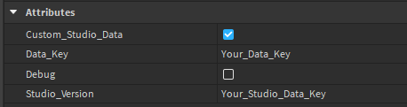

## Data Manager (ProfileStore) **0.1**

> [!NOTE]
> This is official version of my Data Manager using loleris ProfileStore module <br>
> <strong><span style="color: blue;">Version: 0.1</span></strong>

<sub>[Loleris - ProfileStore module](https://devforum.roblox.com/t/profilestore-save-your-player-data-easy-datastore-module/3190543/1)</sub>

> [!WARNING]
> This data manager had only basic tests, it can contain some bugs, if you find any bugs, contact me on discord <br>
> <sub>DISCORD: **bartizer**</sub>

This data manager allows client to read-only access of player data, it's not using any instances for displaying values (excluding leaderstats)
If you bought this Data Manager you will get every update / bug fix for free!

### Implementation
<details>
  <summary>Read more</summary>

  #### How to implement data manager?
  Create in ServerScriptService script, and copy-paste script below

  ```lua
  -- (Server Side Script)
  local DataManager = require(game.ServerScriptService.DataManager) -- path to mine data manager
  DataManager.init() -- initialize it so everything get loaded
  ```

  ### How to reset / change global data key?
  

</details>

### Methods
<details>
  <summary>Read more</summary>

  ```luau
  DataManager:GetProfile(player) -- [player profile]
  ```
  ```luau
  DataManager:GetReplica(player) -- [player replica]
  ```
  ```luau
  DataManager:GetData(player) -- [player profile.Data]
  ```
  ```luau
  DataManager:GetValue(player : Player, path : string) -- [(number | string | boolean)?]
  ```
  ```luau
  DataManager:SetValue(player : Player, path : string, newValue : (string | number | boolean | {any?})?) -- 
  ```
  ```luau
  DataManager:AddValue(player : Player, path : string, addValue : (number | {any?})?) -- 
  ```
  ```luau
  DataManager:SubValue(player : Player, path : string, addValue : (number | {any?})?) -- 
  ```
  ```luau
  DataManager:ResetData(userId : number) -- [boolean]
  ```
  ```luau
  DataManager:Leaderstats(player : Player) -- 
  ```
  ```luau
  DataManager:GetBackup(userId : number, sort_direction : Enum.SortDirection?, min_date : DateTime?, max_date : DateTime?) 
  -- [profile]
  ```
  ```luau
  DataManager:LoadBackup(backupProfile : profile) -- [boolean]
  ```
  ```luau
  DataManager:MessageAsync(userId : number, message : {any?}) -- [boolean]
  ```
  
  
</details>
