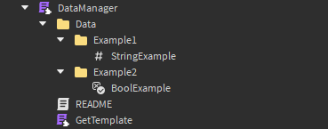

## Data Manager (ProfileStore) **r0.1bf**

<sub>The documentation is for people who have purchased my Data Manager, so if you haven't purchased it and you want to, then email me on discord (bartizer)</sub>

> [!NOTE]
> This is official version of my Data Manager using loleris ProfileStore module <br>
> <strong><span style="color: blue;">Version: r0.1bf</span></strong>

<sub>[Loleris - ProfileStore module](https://devforum.roblox.com/t/profilestore-save-your-player-data-easy-datastore-module/3190543/1)</sub>

> [!WARNING]
> This data manager had only basic tests, it can contain some bugs, if you find any bugs, contact me on discord <br>
> <sub>DISCORD: **bartizer**</sub>

> [!IMPORTANT]
> I am from Poland so there will be a lot of grammatical errors in this documentation so if you know English well you can send me a grammatically corrected version on discord

This data manager allows client to read-only access of player data, it's not using any instances for displaying values (excluding leaderstats)
If you bought this Data Manager you will get every update / bug fix for free!

### Implementation
<details>
  <summary>Read more (Click)</summary>

  #### How to implement data manager?
  Create in ServerScriptService script, and copy-paste script below

  ```lua
  -- (Server Side Script)
  local DataManager = require(game.ServerScriptService.DataManager) -- path to mine data manager
  DataManager.init() -- initialize it so everything get loaded
  ```

  ### How to reset / change global data key?
  Click on the data manager script, and scroll to the attributes properties, there you will find these variables:
   <br>
  [Custom_Studio_Data] will make that studio data and live server data will always be different. <br>
  [Data_Key] will change both, live servers and studio datas. <br>
  [Studio_Version] will change only studio data (only if Custom_Studio_Data is checked) <br>
  [Debug] if checked then every time a value in player changes it will print player profile (useful for debugging only)
  
  ### How to add more variables into player?
  If you expand DataManager module script you will find "Data" folder there, <br>
  every instance added there will be converted into table / string / number / boolean  <br>
  
  for example, this: <br>
   <br>
  will look like this in profile.Data <br>
  ```luau
  {
    ["Example1"] = {
      ["StringExample"] = "StringValue"  
    },
    ["Example2"] = {
      ["BoolExample"] = true
    }
  }
  ```

  ### How to add leaderstats?
  To add leaderstats you need only to add **leaderstats** folder into Data, and the rest leave to the Data Manager :D

</details>

### Methods
<details>
  <summary>Read more (Click)</summary>

  ```luau
  DataManager:GetProfile(player) -- [player profile]
  ```
  ```luau
  DataManager:GetReplica(player) -- [player replica]
  ```
  ```luau
  DataManager:GetData(player) -- [player profile.Data]
  ```
  ```luau
  DataManager:GetValue(player : Player, path : string) -- [(number | string | boolean)?]
  ```
  ```luau
  DataManager:SetValue(player : Player, path : string, newValue : (string | number | boolean | {any?})?) -- 
  ```
  ```luau
  DataManager:AddValue(player : Player, path : string, addValue : (number | {any?})?) -- 
  ```
  ```luau
  DataManager:SubValue(player : Player, path : string, addValue : (number | {any?})?) -- 
  ```
  ```luau
  DataManager:ResetData(userId : number) -- [boolean]
  ```
  ```luau
  DataManager:Leaderstats(player : Player) -- 
  ```
  ```luau
  DataManager:GetBackup(userId : number, sort_direction : Enum.SortDirection?, min_date : DateTime?, max_date : DateTime?) 
  -- [profile]
  ```
  ```luau
  DataManager:LoadBackup(backupProfile : profile) -- [boolean]
  ```
  ```luau
  DataManager:MessageAsync(userId : number, message : {any?}) -- [boolean]
  ```
</details>

### Changelog

| Symbol | Description | 
  |------------|------------|
  | r | Official release | 
  | bf | Version containing bug fixes | 

<details>
  <summary>r0.1bf - <strong>(31.01.2025)</strong></summary>

  **Server**  
  - Fixed `DataManager:LoadBackup(profile)`, which was either not loading backups or, when loaded, kicking the player after rejoining.  

  **Client**  
  - Fixed `DataScript:GetData()`, which was returning a blank table when called too early.  
  - Added `DataScript.IsReady` which returns boolean, returns true when client data loaded properly.
  - Added `DataScript.WaitUntilReady()` which yield `task.wait()` until `DataScript.IsReady` becomes true.

</details>
